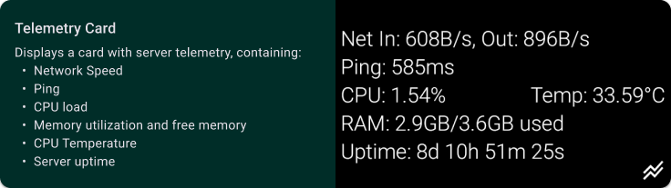
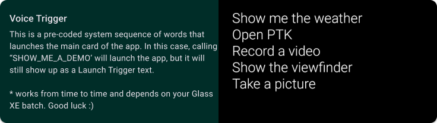
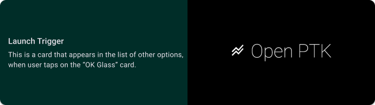

# Glass PTK

This is a port of my [PTK App](https://github.com/Puzzaks/PTK) for the Google Glass XE. It is not finished and probably won't be as developing for Glass is extremely hard and requires more knowledge than I ever had. With that out of the way, here's a short resume of this app.

---

### Features

 - **Telemetry**: Displays a card with server telemetry, containing:
    - Network Speed
    - Ping
    - CPU load
    - Memory utilization and free memory
    - CPU Temperature
    - Server uptime
 - **Glass SDK** is used for this app
 - **Integration** into the system and support for voice commands

#### Telemetry

Using [AIO Script](https://github.com/Puzzak/AIO-Monitor) the server can report it's telemetry to any client that can utilize it's data. Data is encoded as a JSON object and is received using regular GET request. While you can update it at whatever interval you want, both PTK and Glass PTK are updating once per second. This is to ensure close to realtime interaction.
Card contains:
- Network Speed
- Ping
- CPU load
- Memory utilization and free memory
- CPU Temperature
- Server uptime

#### Glass SDK
Glass SDK was deprecated a long time ago, so in order to use it you have to install additional Android Studio instance. It has to be Android Studio 2.3.2.0, you can download it here for [Windows](https://redirector.gvt1.com/edgedl/android/studio/install/2.3.2.0/android-studio-bundle-162.3934792-windows.exe). You have to install old Gradle and find "obsolete" package named `Glass Development Kit Preview` under `Android 4.4 (KitKat)`, which has API level of 19. This is the only SDK that supports Glass Card API. Then you can import the project, set it up and build the app. Caution, you MUST NOT update anything that has version in this repository, as newer Gradle version do not have support for Glass.

In Run Configuration, under "Launch" you have to choose "nothing", as Glass Cards are not the usual Android screens.

#### System Integration
As stated previously, Glass API allows this app to be integrated into the system. This comes as two separate triggers: voice trigger and launch keyword. First one is self-explanatory, you have to say "OK Glass", following by one of pre-coded voice triggers.
For the launch trigger, you can use any text, it will be shown in the selector that is under the main (clock) card.
##### Voice Trigger

You can set up voice trigger in the file `app\src\main\res\xml\voice_trigger.xml`. You have to select one of existing commands, as Glass OS can only recognize select number of commands. You can find the full list [here](https://developers.google.com/glass/develop/gdk/reference/com/google/android/glass/app/VoiceTriggers.Command). I've used `SHOW_ME_A_DEMO` command here. You have to set it up in the `app\src\main\AndroidManifest.xml` in the default service.
##### Launch trigger

You can set up launch keyword in the file `app\src\main\res\xml\launch_trigger.xml`. It will be displayed in the list of launchable actions, alongside with system actions like "Record video" or "Show viewfinder". You have to set it up in the `app\src\main\AndroidManifest.xml` in the default service.